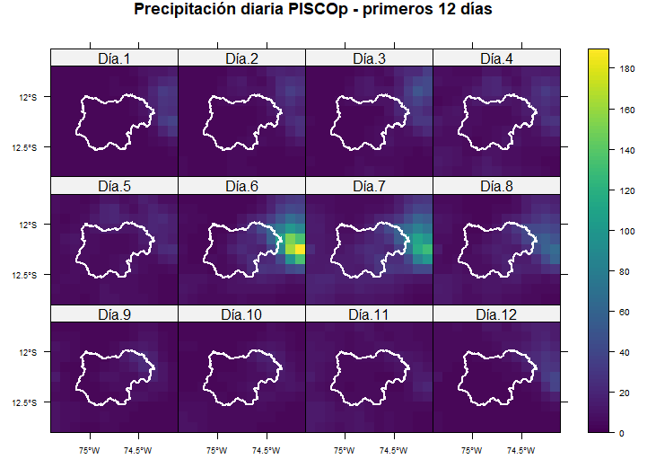
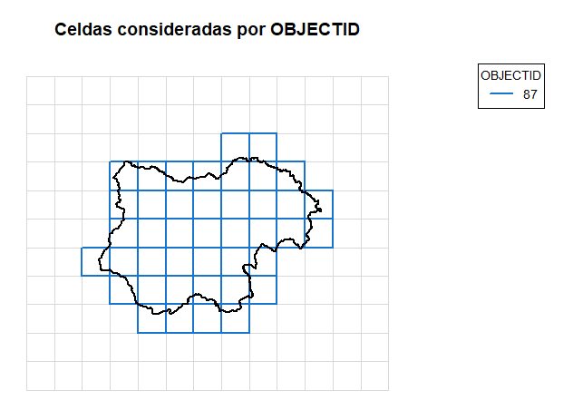
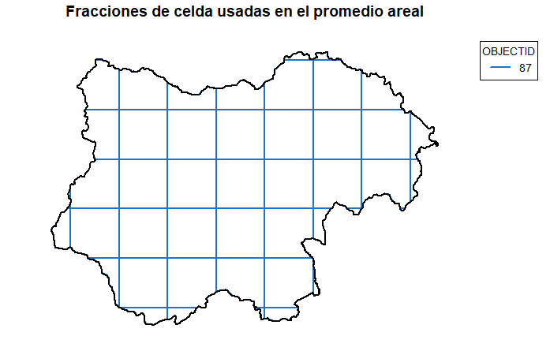
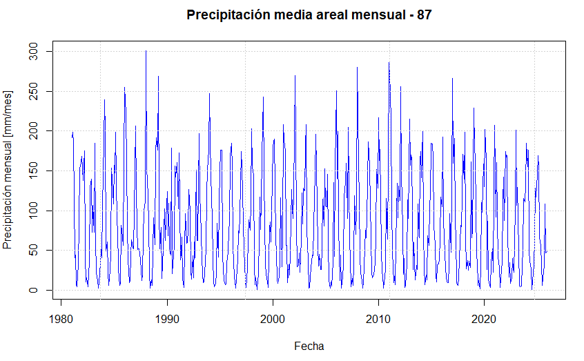

# pisco-areal-precipitation-r

Script en R para calcular precipitación media areal diaria y mensual a partir de PISCOp diario, usando ponderación espacial por fracción de celda y área real.

El flujo está pensado para estudios hidrológicos, análisis de sequías, disponibilidad hídrica y procesamiento climático a escala de cuenca, subcuenca, provincia o unidad hidrográfica.

---

## ¿Por qué usar este enfoque?

PISCOp es una base de precipitación grillada. En muchos análisis rápidos se suele extraer el valor de la celda asociada al centroide del área de estudio.

Sin embargo, cuando una cuenca, provincia o unidad hidrográfica intersecta varias celdas del raster, esa aproximación puede no representar adecuadamente la variabilidad espacial de la precipitación.

Este script calcula un promedio areal ponderado considerando:

* La fracción de cada celda que cae dentro del polígono.
* El área real de cada celda.
* La precipitación diaria de cada celda intersectada.

De esta forma, se obtiene una serie de precipitación más representativa para el área de análisis.

---

## ¿Qué hace el código?

El script realiza los siguientes pasos:

1. Lee el archivo NetCDF diario de PISCOp.
2. Lee el shapefile del área de análisis.
3. Verifica el sistema de coordenadas del shapefile.
4. Transforma el shapefile al CRS del raster.
5. Recorta el raster al entorno del área de estudio.
6. Identifica las celdas que intersectan el polígono.
7. Calcula la precipitación media areal diaria mediante `exactextractr`.
8. Agrega la precipitación diaria a escala mensual.
9. Muestra gráficos de control en RStudio.
10. Exporta las series diaria y mensual en formato CSV.

---

## Método de cálculo

El promedio areal se calcula mediante una media ponderada:

```text
P_areal = sum(P_i * f_i * A_i) / sum(f_i * A_i)
```

Donde:

* `P_areal`: precipitación media areal.
* `P_i`: precipitación de la celda i.
* `f_i`: fracción de la celda i dentro del polígono.
* `A_i`: área real de la celda i.

En el script, el cálculo principal se realiza con:

```r
area_celda <- area(pisco_crop[[1]])

pp_areal <- exact_extract(
  pisco_crop,
  cuenca_sf,
  "weighted_mean",
  weights = area_celda,
  progress = TRUE
)
```

---

## Requisitos

El script requiere R y los siguientes paquetes:

```r
install.packages(c(
  "ncdf4",
  "raster",
  "sf",
  "sp",
  "viridisLite",
  "exactextractr"
))
```

Luego, los paquetes se cargan en el script con:

```r
library(ncdf4)
library(raster)
library(sf)
library(sp)
library(viridisLite)
library(exactextractr)
```

---

## Archivos necesarios

Para ejecutar el script, se debe contar con el NetCDF diario de PISCOp y un shapefile del área de análisis:

```text
PISCOp_d.nc
area_de_estudio.shp
area_de_estudio.dbf
area_de_estudio.shx
area_de_estudio.prj
areal_pisco_v2.R
```

El archivo `.prj` es importante porque el script valida que el shapefile tenga sistema de coordenadas definido.

> Nota: el archivo NetCDF de PISCOp y los shapefiles de entrada no se incluyen en este repositorio. Cada usuario debe trabajar con sus propios datos.

---

## Configuración del usuario

Antes de ejecutar el script, se deben modificar estas líneas:

```r
setwd("C:/codigo/1. Areal PISCO")

nc_file   <- "PISCOp_d.nc"
shp_layer <- "Tayacaja_prov"
```

### 1. Ruta de trabajo

Modificar la ruta según la carpeta donde se encuentren el NetCDF y el shapefile:

```r
setwd("C:/codigo/1. Areal PISCO")
```

Por ejemplo:

```r
setwd("D:/proyectos/pisco_areal")
```

### 2. Nombre del NetCDF

Colocar el nombre del archivo NetCDF de PISCOp:

```r
nc_file <- "PISCOp_d.nc"
```

### 3. Nombre del shapefile

Colocar el nombre del shapefile sin la extensión `.shp`.

Por ejemplo, si el archivo se llama:

```text
Cuenca_Mantaro.shp
```

entonces se debe usar:

```r
shp_layer <- "Cuenca_Mantaro"
```

### 4. Campo identificador

El script busca automáticamente un campo identificador dentro del shapefile usando esta lista:

```r
id_candidates <- c("ID_UH", "UD_H", "OBJECTID", "Name", "NOMBRE", "CODIGO")
```

Si el shapefile tiene otro campo identificador, puede agregarse dentro de esa lista.

Por ejemplo:

```r
id_candidates <- c("COD_CUENCA", "NOMBRE", "OBJECTID")
```

### 5. Unidad a graficar

Si el shapefile contiene varios polígonos, se puede elegir cuál graficar en la serie diaria y mensual mediante:

```r
uh_plot <- 1
```

Por ejemplo:

* `uh_plot <- 1`: grafica el primer polígono.
* `uh_plot <- 2`: grafica el segundo polígono.
* `uh_plot <- 3`: grafica el tercer polígono.

---

## Periodo de análisis

El script está configurado para el periodo completo:

```r
fecha_ini <- as.Date("1981-01-01")
fecha_fin <- as.Date("2025-12-31")
```

Si se usa un NetCDF con otro rango temporal, estas fechas deben modificarse para que coincidan con el número de capas del archivo.

El script verifica que el número de capas del NetCDF coincida con el número de días del periodo configurado. Si no coincide, se detiene para evitar una asignación incorrecta de fechas.

---

## Gráficos generados

El script muestra cinco gráficos directamente en el panel de Plots de RStudio:

1. Panel de precipitación diaria para los primeros 12 días.
2. Celdas consideradas por intersección espacial.
3. Fracciones de celda usadas en el promedio areal.
4. Serie diaria de precipitación media areal.
5. Serie mensual de precipitación media areal.

Las figuras de ejemplo se incluyen en la carpeta `figures/`.

---

## Ejemplos visuales

### Panel de precipitación diaria



### Celdas consideradas por intersección



### Fracciones de celda usadas en el promedio areal



### Serie mensual de precipitación media areal



> Si las imágenes no se visualizan, revisar que los nombres de los archivos dentro de la carpeta `figures/` coincidan con los nombres usados en este README.

---

## Archivos de salida

El script exporta dos archivos CSV:

```text
pp_tayacaja_diaria_areal_PISCO.csv
pp_tayacaja_mensual_areal_PISCO.csv
```

El primer archivo contiene la serie diaria de precipitación media areal.

El segundo archivo contiene la serie mensual acumulada.

Los nombres de salida pueden modificarse al final del script según el área de estudio.

---

## Estructura sugerida del proyecto

```text
pisco-areal-precipitation-r/
├── areal_pisco_v2.R
├── README.md
├── LICENSE
├── .gitignore
└── figures/
    ├── 01_panel_pisco.png
    ├── 02_celdas_consideradas.png
    ├── 03_fracciones_celda.png
    └── 04_serie_mensual.png
```

---

## Notas importantes

* El archivo NetCDF de PISCOp no se incluye en este repositorio.
* Los shapefiles de entrada tampoco se incluyen, ya que cada usuario debe usar su propia área de análisis.
* El script asume que el NetCDF diario tiene una capa por día.
* El shapefile debe tener un sistema de coordenadas definido.
* Si el número de capas del NetCDF no coincide con el rango de fechas configurado, el script se detendrá para evitar errores en la asignación temporal.
* Los archivos CSV generados no se incluyen en el repositorio, ya que dependen del área de estudio usada por cada usuario.

---

## Aplicaciones posibles

Este flujo puede ser útil para:

* Estudios hidrológicos.
* Análisis de sequías.
* Series climáticas a escala de cuenca.
* Evaluación de disponibilidad hídrica.
* Procesamiento de precipitación grillada.
* Comparación entre unidades hidrográficas.
* Preparación de información para índices como SPI, SPEI u otros indicadores climáticos.

---

## Limitaciones

Este script está diseñado como una herramienta práctica de procesamiento espacial para PISCOp diario. Su aplicación debe considerar la calidad del shapefile de entrada, el sistema de coordenadas, la resolución espacial del producto grillado y el objetivo del análisis.

El cálculo representa un promedio areal ponderado sobre el área definida por el usuario. No reemplaza procesos adicionales de validación hidrológica, control de calidad o comparación con estaciones meteorológicas cuando estos sean necesarios.

---

## Contribuciones

Los comentarios, correcciones y sugerencias son bienvenidos.

Si encuentras un error, tienes una propuesta de mejora o deseas adaptar el flujo a otro caso, puedes abrir un issue o enviar un pull request.

---

## Autor

Paolo Silva Moran

---

## Licencia

Este proyecto se distribuye bajo licencia MIT. El código puede ser usado, modificado y adaptado, manteniendo la referencia correspondiente al autor original.
